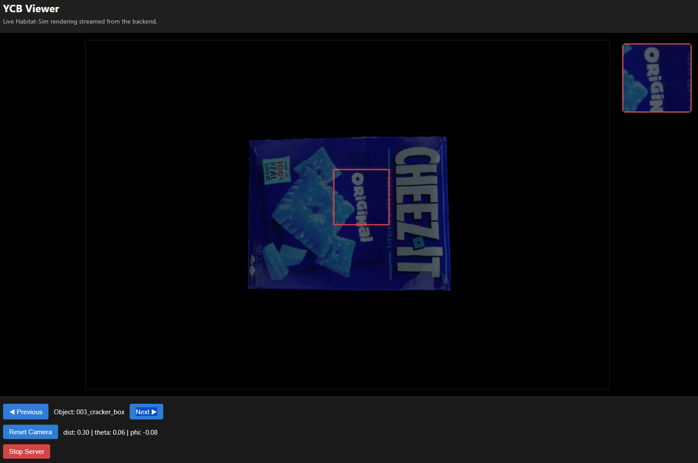

# YCB Object Viewer

A 3D interactive viewer for YCB objects using FastAPI and Habitat-Sim.



## Features

- **3D Object Rendering**: View YCB objects in a black void environment with proper lighting
- **Interactive Camera Controls**: 
  - Mouse wheel: Zoom in/out with asymptotic deceleration
  - Right click + drag: Orbit camera around object (inverted controls)
- **Magnifying Glass**: Red square patch view with picture-in-picture magnification
  - Left click + drag: Move patch view around screen
  - Magnified view displayed in upper-right corner
- **Object Navigation**: Cycle through all available YCB objects
- **Automatic Framing**: Objects are automatically positioned and scaled to fill the frame

## Setup

### Initial Setup
```bash
conda env create -f environment.yml
```

### Run the Viewer
```bash
# Easy startup (recommended)
./start_viewer.sh

# OR manually:
conda activate sdr-dashboard
python ycb_viewer.py
```

## Controls

- **Mouse Wheel**: Zoom camera toward/away from object
- **Right Click + Drag**: Orbit camera around object (up/down, left/right)
- **Left Click + Drag Red Square**: Move magnifying glass patch view
- **Arrow Keys / Left/Right Buttons**: Cycle between objects
- **Ctrl+C or X Button**: Exit application

## Display

- Main view shows the selected YCB object with RGB textures
- Red square indicates the patch view area (50x50 pixels)
- Upper-right corner shows magnified view (4x zoom) of the patch area
- Bottom controls show current object name and navigation buttons
- Directional lighting from camera position illuminates the object

## Requirements

- Conda environment with Habitat-Sim, OpenCV
- YCB object meshes and configurations
- Generated void scene for rendering

## Troubleshooting

If objects don't load properly:
1. Ensure YCB assets are downloaded: `python scripts/download_ycb.py`
2. Check that void scene exists: `python scripts/generate_void_scene.py`
3. Verify conda environment is activated: `conda activate sdr-dashboard`
4. Running inside WSL2 and seeing `WindowlessContext` or `WindowlessEglApplication` errors? Force CPU rendering:
  ```bash
  export YCB_VIEWER_FORCE_CPU=1
  export MAGNUM_GPU_DRIVER=none
  python ycb_viewer.py
  ```
  The `start_viewer.sh` script does this automatically when it detects WSL.

The viewer handles CPU/GPU rendering automatically and exits cleanly on Ctrl+C.